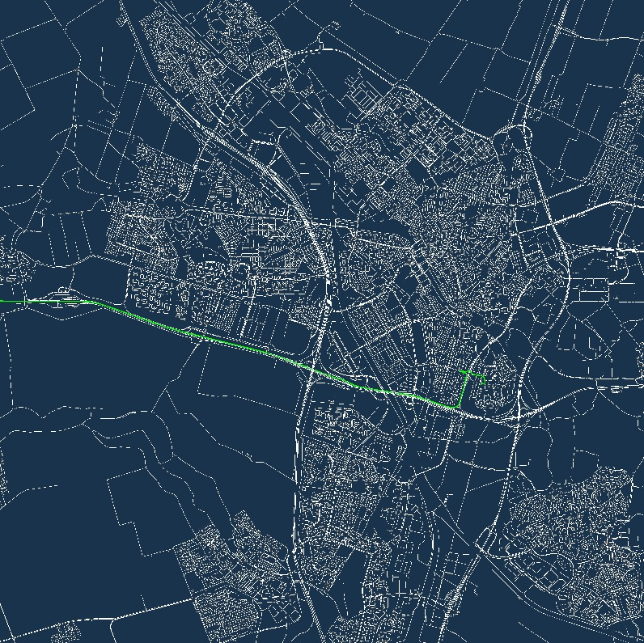

# Dutch roadmap



Implementation of Highway node routing. Using the Dutch road network as data.

https://www.rijkswaterstaat.nl/apps/geoservices/geodata/dmc/weggeg/geogegevens/shapefile/
https://www.rijkswaterstaat.nl/apps/geoservices/geodata/dmc/nwb-wegen/geogegevens/shapefile/Nederland_totaal/


https://www.rijkswaterstaat.nl/apps/geoservices/geodata/dmc/nwb-wegen/productinfo/beschrijvende_documentatie/

## Data
https://www.rijkswaterstaat.nl/apps/geoservices/geodata/dmc/nwb-wegen/geogegevens/shapefile/Nederland_totaal/01-12-2020/Wegvakken/
```
> data
    > Hectopunten
    > Wegvakken
```

## Current goals

- Visualize
- Junctions 
- Create network
    - rijrichting (RIJRICHTING)
    - juncties (JTE_ID_BEGIN -> JTE_ID_END)


## Layered Network:

[Highway node routing](http://algo2.iti.uni-karlsruhe.de/schultes/hwy/dynamic.pdf).
[Engineering Highway hierarchies](http://algo2.iti.kit.edu/documents/routeplanning/hhJournalSubmit.pdf)

A network consists of roads (wegvakken) and their connections (juncties).

- Roads can be one-way or two-way
- Roads should have their attributes
- Hectometerized roads have a Baanpostie_tov_Wol 
    - wol (wegoriëntatie lijn)
    - R#, M, L#
    - are probably connected to each other
- Would be nice if it could be streamed.

### Streaming of network?
What I think of streaming.

The aim is the create a layered network. A node in the network can lead to a higher layer. Higher layers have fewer nodes, and represent abstracted roads.

Assuming the network is used for pathfinding between two different points.
The search is started at these two points and will meet each other halfway at the same level.
> Conclusion: A region around the starting points at level 0 is loaded at start. 
> when ascending levels, region around the entry points of these levels are loaded when needed.

### Precomputing

A basic network needs to be created: Level 0.
Then multiple layers need to be created: 


## Current results

```
Run 1: 2.2795905s
```
```csv
,zoetermeer,utrecht,utrecht_2,neude,uithof,bergen,houten,
zoetermeer,,50946.45,50322.715,50111.44,53953.35,80725.05,54263.38,
utrecht,51225.484,,5354.6606,4265.7026,4742.7646,84724.62,5600.5645,
utrecht_2,50796.633,5060.5063,,1164.632,5332.3003,79986.664,9824.358,
neude,50779.85,4255.081,1157.498,,4167.669,80964.22,8975.79,
uithof,54777.03,4920.308,5369.535,4257.854,,85173.07,7696.2603,
bergen,81383.22,84621.484,80177.72,81159.22,85326.86,,89780.49,
houten,55107.62,5600.5654,9888.047,8799.086,7689.0938,89691.586,,
```